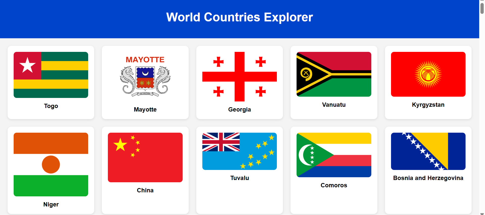

# Code Challenge 3 – World Countries and Flags Explorer

A web application for exploring countries around the world. Built using HTML, CSS, and JavaScript. It fetches live data from the [REST Countries API](https://restcountries.com/) and allows users to view country details including flags, population, capital, currencies, languages, and region.

By Cassy Omondi

---

## Screenshot



---

## Features

- View a grid of country cards showing flags and names
- Click a card to view detailed information (capital, population, region, currency, languages)
- Fully responsive layout for both desktop and mobile devices
- Modal pop-up for country detail view
- Uses real-time data from the REST Countries API

---

### View Live Site

Visit the deployed application at: **https://evansveryown.github.io/phase-1-final-project/**

---

## How to Use

### Requirements
- A computer, phone, or tablet
- A modern web browser (Chrome, Firefox, Edge, Safari)

#### 1. Clone the repository:
```bash
git clone https://github.com/evansveryown/phase-1-final-project.git

Or download the ZIP and extract it.
```

#### 2. Navigate to the project folder:
```bash
cd phase-1-final-project
```

#### 3. Open index.html in your browser:
You can double-click index.html, or use a live server extension in VS Code and visit http://localhost:5500

 --- 

 # Author

Cassy Omondi

# License

MIT License

Copyright © 2025 Cassy Omondi

Permission is hereby granted, free of charge, to any person obtaining a copy of this software and associated documentation files (the "Software"), to deal in the Software without restriction, including without limitation the rights to use, copy, modify, merge, publish, distribute, sublicense, and/or sell copies of the Software, and to permit persons to whom the Software is furnished to do so, subject to the following conditions:

The above copyright notice and this permission notice shall be included in all copies or substantial portions of the Software.

THE SOFTWARE IS PROVIDED "AS IS", WITHOUT WARRANTY OF ANY KIND, EXPRESS OR IMPLIED, INCLUDING BUT NOT LIMITED TO THE WARRANTIES OF MERCHANTABILITY, FITNESS FOR A PARTICULAR PURPOSE AND NONINFRINGEMENT. IN NO EVENT SHALL THE AUTHORS OR COPYRIGHT HOLDERS BE LIABLE FOR ANY CLAIM, DAMAGES OR OTHER LIABILITY, WHETHER IN AN ACTION OF CONTRACT, TORT OR OTHERWISE, ARISING FROM, OUT OF OR IN CONNECTION WITH THE SOFTWARE OR THE USE OR OTHER DEALINGS IN THE SOFTWARE.